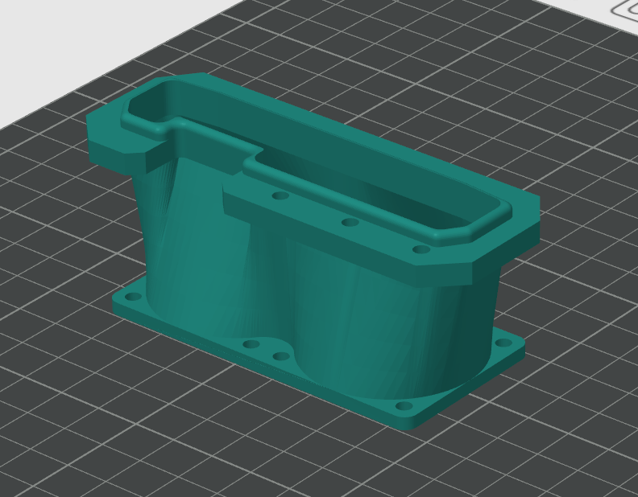

# Printable GPU fan mount

The mount design used for this personal project is included for anyone who wants
to print the same part. It was designed for the author's setup with two 40 mm
fans per GPU; compatibility with other GPUs, fans or cases is not guaranteed.

- [Download the STL model: GpuFanMount.stl](GpuFanMount.stl)
- [View the reference image: GPUFanMount.png](GPUFanMount.png)

## Download and print

On GitHub, open the STL link and use **Download raw file**. Save the actual STL,
not the HTML preview page, then open it in your slicer. A source checkout also
contains both files in `docs/`. Ubuntu release packages include the model, image
and this guide under `/usr/share/doc/gpu-fan-controller/`.

No validated printer profile, material, layer height, infill, support settings or
fastener specification is supplied. The image is a reference, not a validated
print-orientation or support recommendation. STL does not encode units; check
the imported dimensions against your fans and GPU before printing. Do not assume
automatic scaling will preserve the required fit.

## Check before use

With the system powered off, verify fan spacing, mounting holes, fastener length,
GPU attachment and case clearance. Keep the mount and fasteners clear of circuit
boards, fan blades and wiring, and ensure the airflow path is unobstructed.
Choose material and print settings suitable for the temperatures and mechanical
loads in your system; this design has no stated thermal or load rating.

Inspect the finished print for defects and check that it holds the fans securely.
After installation, supervise initial operation and check GPU temperatures,
airflow, vibration and any signs of deformation before relying on it for cooling.
Fan RPM alone does not prove that airflow through the GPU is adequate.

The mount is supplied as is, with no guarantee of fit or cooling performance.
See the project's [risk notice](../README.md#use-at-your-own-risk) and
[license](../LICENSE). For controller wiring, see the
[schematic](FanController-Schematic.pdf).
