# FanCtl user manual

A practical guide to setting up and using the GPU Fan Controller terminal
application. FanCtl is designed for headless Ubuntu Server operation over SSH:
no graphical desktop or display server is required. The same mouse/keyboard UI
also runs locally in an Ubuntu terminal. For remote use, SSH into the server and
run FanCtl there; graphical forwarding is not needed.

This guide describes **FanCtl and firmware 1.7.0**. Older versions may not offer
all the controls shown here.

The screenshots show the **real application using simulated controllers**.
Every screenshot is marked accordingly. GPU temperatures, curves, currents and
thresholds in these images are examples, **not recommended settings** for a
Tesla V100 or any other GPU. Click an image to see it at full size on GitHub.

## Contents

- [Before you start](#before-you-start)
- [NVIDIA and AMD GPUs](#nvidia-and-amd-gpus)
- [Find your way around](#find-your-way-around)
- [One Save changes button](#one-save-changes-button)
- [1. Discover and map your hardware](#1-discover-and-map-your-hardware)
- [Using multiple fan controllers](#using-multiple-fan-controllers)
- [2. Tell the Nano which fans are connected](#2-tell-the-nano-which-fans-are-connected)
- [3. Calibrate each used group](#3-calibrate-each-used-group)
- [4. Set the temperature/RPM curve](#4-set-the-temperaturerpm-curve)
- [5. Set alert thresholds and startup settings](#5-set-alert-thresholds-and-startup-settings)
- [6. Verify cooling with live monitoring](#6-verify-cooling-with-live-monitoring)
- [Respond to alerts](#respond-to-alerts)
- [Everyday tasks](#everyday-tasks)
- [Troubleshooting](#troubleshooting)

## Before you start

Install the host software and controller firmware using the
[installation guide](RELEASES.md). A blank Nano cannot be discovered until the
controller firmware has been uploaded. NVIDIA needs working drivers with NVML
(`libnvidia-ml.so.1`) and `nvidia-smi` for discovery/setup metadata;
AMD support is [experimental](AMD_SUPPORT.md) and uses the native
Linux `amdgpu` edge-temperature sensor. Intel is not supported yet.

Stop GPU workloads before initial setup or calibration. Turn on the fan's 12 V
supply, check the wiring and common ground, and keep the hardware in sight.
USB power alone powers the Nano, **not the 12 V fans**. Never rewire powered
hardware. See the [schematic](FanController-Schematic.pdf) and
[project safety disclaimer](https://github.com/MikeInNs/GpuFanController#use-at-your-own-risk).

Start the application as your normal user:

```sh
fanctl
```

It connects to the local daemon; you do not need to run the UI with `sudo`.
For remote use, SSH into the Ubuntu server and run `fanctl` there. Use a terminal
at least **76 columns by 24 rows**, preferably 100 by 32 or larger. The screenshots
use 120 by 36. Mouse support depends on your SSH terminal passing mouse events;
the keyboard remains available.

Three parts have different jobs:

- The **Nano** runs the fan curve, calibration and safety checks.
- The **daemon** sends GPU temperatures to the correct Nano group and receives
  replies and alerts. It must remain running.
- **FanCtl** is the control panel. Closing it does not stop cooling or the daemon.

## NVIDIA and AMD GPUs

Use the same Setup, calibration and curve workflow for either supported vendor.
You can use NVIDIA-only, AMD-only or mixed systems: the two groups on one Nano
may cool different GPU vendors, and additional Nanos use the same daemon.

- **NVIDIA:** install working NVIDIA drivers and check `nvidia-smi`. Regular GPU
  core temperatures come from a persistent NVML helper: it initializes once and
  reuses the session, rather than launching the tool every second. Discovery and
  explicit thermal suggestions still use one-off CLI queries. The author's
  hardware uses Tesla V100s; validate the reader and cooling on your own system.
- **AMD (experimental):** use native Linux with the `amdgpu` driver and a GPU
  edge-temperature sensor readable by the daemon. ROCm and `nvidia-smi` are not
  required for AMD-only mappings. This path has automated fixture tests but
  has not been validated on physical AMD hardware.
- **Intel and legacy AMD `radeon`:** not currently supported.

During discovery, check each GPU's PCI address, vendor and any sensor warnings.
An AMD GPU can be listed even when its temperature is unavailable. Its source is
GPU **edge**, not hotspot/junction or memory; there is no automatic fallback.
Choose curves and thresholds for the actual source, then verify live temperatures
before applying GPU load. GPU visibility in WSL alone does not provide the native
AMD sensor interface. See [AMD setup and troubleshooting](AMD_SUPPORT.md).

## Find your way around

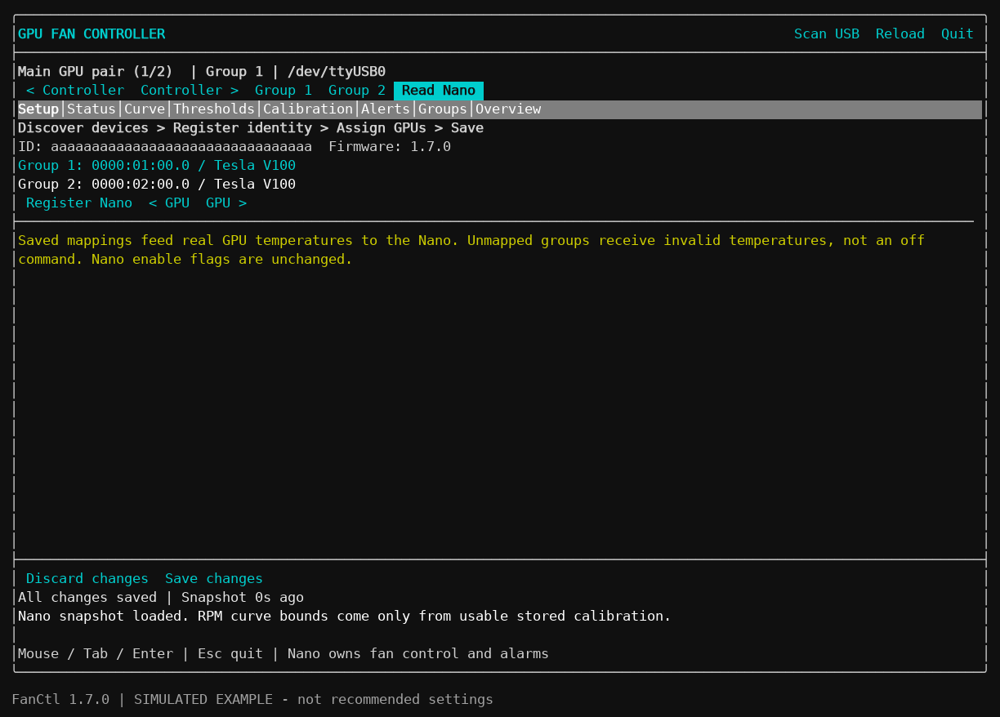

Check the **controller name, Group 1/Group 2 and USB path above the tabs** before
changing anything. `< Controller` / `Controller >` select a different Nano;
`Group 1` / `Group 2` select the fan pair on that Nano. A group normally cools
one GPU. USB paths can change; the saved controller identity is what matters.

In **Setup**, edit **Controller name** for a registered Nano (for example,
`V100 cooling`), then use **Save changes** and confirm the review. The name uses
1-64 printable ASCII characters and cannot be blank. It is saved in the daemon's
configuration, not on the Nano; the permanent UUID, GPU mappings and calibration
are unchanged. Names need not be unique, so always check the port/identity too.
The firmware updater also shows saved names in its numbered controller picker.
Unsaved names survive tab/group/controller switches and Reload, and can be
discarded with other drafts. The Setup screenshot above predates this name field.

Click a tab or button with the mouse. Use **Tab / Shift+Tab** to move focus and
**Enter** to activate. **Esc** closes a dialog or quits; unsaved edits prompt
before they are discarded. Dialogs default to the safe Cancel choice: explicitly
select **Confirm** when you intend to proceed.

On Status, Overview, Calibration and Alerts, click the content, then scroll with
the wheel or arrow keys. Home/End jump to the start/end. Enlarge the terminal if
you cannot see all of a table. In the curve graph, arrows edit the selected point
instead of scrolling.

The footer reports pending daemon edits, the number of controllers with edits,
and any unconfirmed writes. **Snapshot … ago** is the age of the settings
readback, not the live Status sample. A **CRITICAL FAULT** banner means you
should open Alerts and investigate.

## One Save changes button

Use **Save changes** in the footer from any page to review all pending persistent edits.

You can edit controller names, mappings, both fan groups, curves, thresholds, startup settings and
the beeper preference before saving. Switching tabs, groups or controllers keeps
your edits—even an unfinished numeric input. None of those actions writes to the
daemon or Nano.

1. Click **Save changes**. FanCtl reads current settings and validates the whole
   draft before writing anything.
2. Review the before/after values and destinations. GPU labels are included
   automatically when needed. Check the warnings, controller IDs and group numbers.
   Scroll the review if necessary; Cancel is the default.
3. Choose **Confirm** to save. Only changed scopes are written.
4. Read **Save results**, then Close. Verify live cooling before applying load.

A save across devices is **not atomic**. One Nano might save successfully while
another disconnects. Nano changes are prepared before changed daemon mappings
are activated. A failed prerequisite keeps the daemon changes pending. Successful
scopes are remembered, so a later attempt does not resend them unnecessarily.

| Result | Meaning / next step |
| --- | --- |
| **SAVED — verified by readback** | The daemon/Nano operation completed and returned the expected settings. |
| **NOT ATTEMPTED / NOT SAVED** | Read the reason; those edits remain pending. Other independent controllers may have completed. |
| **UNCONFIRMED** | The request may have executed, but persistence was not verified. Do not assume rollback or success. |
| **Save blocked** | Fix invalid values or resolve a changed-state conflict before retrying. Validation has not started writes. |

To retry unconfirmed work, click **Save changes** again. FanCtl reads the current
state and presents another review; **nothing is automatically retried**. Matching
RAM settings alone do not prove EEPROM persistence, so the explicit retry can
write those values again. Unrelated external changes block reconciliation.

**Read Nano** and **Reload** preserve pending edits. If settings changed elsewhere,
inspect the fresh readback and explicitly discard/recreate conflicting edits as
needed; FanCtl does not silently overwrite the newer configuration.

**Discard changes** discards the entire shared draft after confirmation and adopts
the latest observations. It does not undo writes that already happened. Discarding
an unconfirmed operation also abandons its retry intent, not the need to verify
cooling and persistence.

Some operations remain separate:

- **Calibration:** deliberately starts/stops fans, has its own confirmation, and
  automatically saves successful verified results. No extra Save is needed.
- **Auto / Full speed / Off:** separately confirmed temporary commands.
- **Alert acknowledgement:** clears remembered latches, not configuration.
- **Register Nano:** explicitly writes a controller identity before mapping it.

## 1. Discover and map your hardware

1. Open **Setup**, click **Scan USB**, read the warning and confirm. Opening a
   serial connection can reset the Nano; keep cooling supervised.
2. Select the required controller. If it is unregistered, click **Register Nano**
   and confirm. This gives it a persistent identity in EEPROM. An already
   registered controller does not need registering again.
3. Select **Group 1**. Use **< GPU / GPU >** to choose the GPU physically cooled
   by that group. Check its PCI address as well as its name: two identical GPUs
   have the same model name.
4. Select **Group 2** and choose its GPU, or choose **none** if unused.
5. Leave the mappings as a draft and click **Read Nano** to configure the fans
   in the next step. If you are only changing an existing mapping, use
   **Save changes**, review and confirm.
6. Repeat for additional controllers as needed.

The GPU arrows skip GPUs already assigned elsewhere. This step tells the daemon
where to send temperatures once saved; it does **not** turn an unused Nano group
off automatically.

### GPU names are included automatically

When supported, Save changes includes GPU labels derived from the proposed
mappings and discovery. There is no separate names-save action.

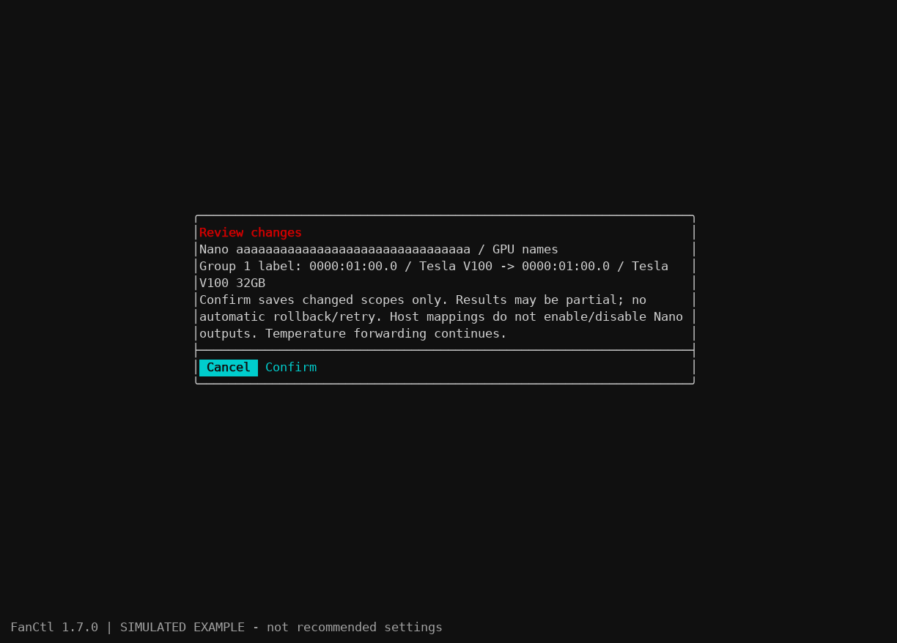

Names are limited to 31 printable ASCII characters; truncation is visible in the
review. A later Read Nano can show these names without another GPU scan. They are
labels, not GPU identification: the PCI mapping still controls forwarding. After
replacing a GPU, scan again and use Save changes to review its new label. Older
firmware without label storage shows a compatibility notice; that cosmetic
limitation does not by itself prevent supported cooling settings from saving.
See [adapter names](NANO_CONFIGURATION.md#adapter-names).

## Using multiple fan controllers

One daemon manages all configured Nanos. Each Nano controls up to two GPUs, with
up to two fans sharing PWM per group. For example, two Nanos can provide four GPU
groups and eight fan connections. Calibration and cooling settings belong to each
Nano/group; they are not copied automatically between boards.

1. With workloads stopped and cooling supervised, connect the controllers and
   **Scan USB**. Select/register each unregistered Nano. Registration gives each
   board its own persistent identity; do not identify boards solely by changing
   `/dev/ttyUSB*` numbers.
2. Use **< Controller / Controller >**, check the selected identity and group,
   and assign each GPU by PCI address. A GPU may belong to only one group across
   all controllers; the GPU arrows skip already assigned GPUs.
3. **Read Nano** for each board and configure its Groups, expected fans and other
   settings. Leave unused host mappings at **none** and explicitly set unused
   Nano groups to **Disabled / None**. Removing a mapping alone does not stop fans.
4. Use **Save changes** once to review all pending destinations. Check every
   result: a multi-device save can partially succeed. Calibrate each used group
   separately, under supervision, before setting its measured-RPM curve.
5. Use **Status** for the selected board, **Overview** for all saved boards, and
   **Alerts** for faults across controllers. Check controller IDs/group numbers
   before calibration, temporary mode changes or alert acknowledgement.

Each controller has an independent temperature-forwarding worker, so a slow or
disconnected board does not block delivery to healthy boards. Saved offline
controllers remain listed. On the affected Nano, loss of temperature packets for
more than 10 seconds invokes the existing full-speed timeout failsafe, including
disabled groups. This cannot protect against loss of fan power or failed hardware.
Closing FanCtl stops detailed UI polling, not temperature forwarding or alerts.

The configuration accepts up to **32 controller records**, but a discovery scan
currently probes at most **eight eligible serial candidates**. This is not a
claim of 32-board simultaneous discovery or hardware-tested capacity. Avoid
unrelated serial devices that cannot tolerate probing/reset. Run only one daemon
against a given Nano; close competing Arduino serial monitors.
See [configuration and discovery details](CONFIGURATION.md).

## 2. Tell the Nano which fans are connected

Open **Groups** for the selected Nano and group.

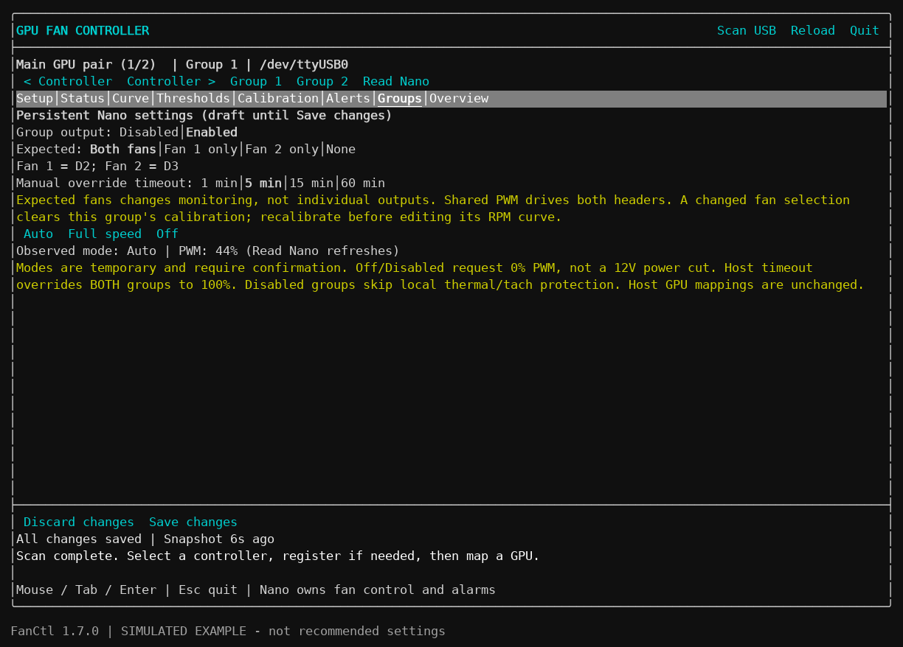

1. Select **Enabled** for a group that must cool a GPU.
2. Set **Expected** to Both fans, Fan 1 only, or Fan 2 only, matching the actual
   connected tachometers. Use Disabled and None for an unused group.
3. Repeat for the other group/controller; the first group’s edits are retained.
4. Click **Save changes**, review mappings and Nano changes together, confirm,
   and check the per-destination readback results.

| Group | Fan 1 tach | Fan 2 tach | Combined current/voltage |
| --- | --- | --- | --- |
| 1 | D2 | D3 | INA3221 CH2 |
| 2 | D5 | D4 | INA3221 CH3 |

Changing the expected fans **clears that group's calibration**. Save this change
first, then calibrate. Do not exclude a failed fan simply to silence its alarm.
Fan selection changes monitoring; it cannot switch one fan independently because
both headers in a group share PWM.

### Only one GPU installed?

Map it to the group that physically cools it. Set the other host mapping to
**none**. Select the unused Nano group and set **Disabled** and **None**.
Use **Save changes** once to review and save both edits. Removing a host mapping alone
leaves the Nano group enabled, without valid temperature data.

### Auto, Full speed and Off

These buttons are **temporary commands**, separate from the persistent group
settings. Save or discard drafts first. The group must be enabled.

- **Auto** resumes the temperature/RPM curve and cancels a temporary override.
- **Full speed** requests 100% PWM for the chosen timeout, then returns to Auto.
- **Off** requests 0% PWM for the chosen timeout, then returns to Auto. Use only
  when cooling can safely be interrupted, with the GPU idle and supervised.

**Manual override timeout** (previously called Full/Off duration) offers 1, 5,
15 or 60 minutes. Selecting a duration alone does nothing; confirm Full speed or
Off to start it. Closing FanCtl does not cancel the override. Check the observed
mode in Read Nano or live Status; a safety condition can override your request.

**Off and Disabled are not a 12 V power cut.** Some fans still spin at 0% PWM.
Never use these buttons as electrical isolation. A host-temperature timeout
forces both groups to full speed, including an Off or Disabled group.

## 3. Calibrate each used group

Calibration teaches the Nano what the installed fans can actually do. It measures
starting and safe running PWM, RPM at nine PWM points, and the pair's current and
voltage. It changes PWM, **not the fan's supply voltage**.

1. Stop GPU workloads. Keep 12 V power on, valid temperature forwarding running,
   and physically supervise the fans. Calibration deliberately stops/slows them.
2. Use Save changes for host mappings and any group edits. Select the correct controller/group,
   click **Read Nano**, then open **Calibration**.
3. Click **Start calibration**, read the confirmation, and explicitly confirm.

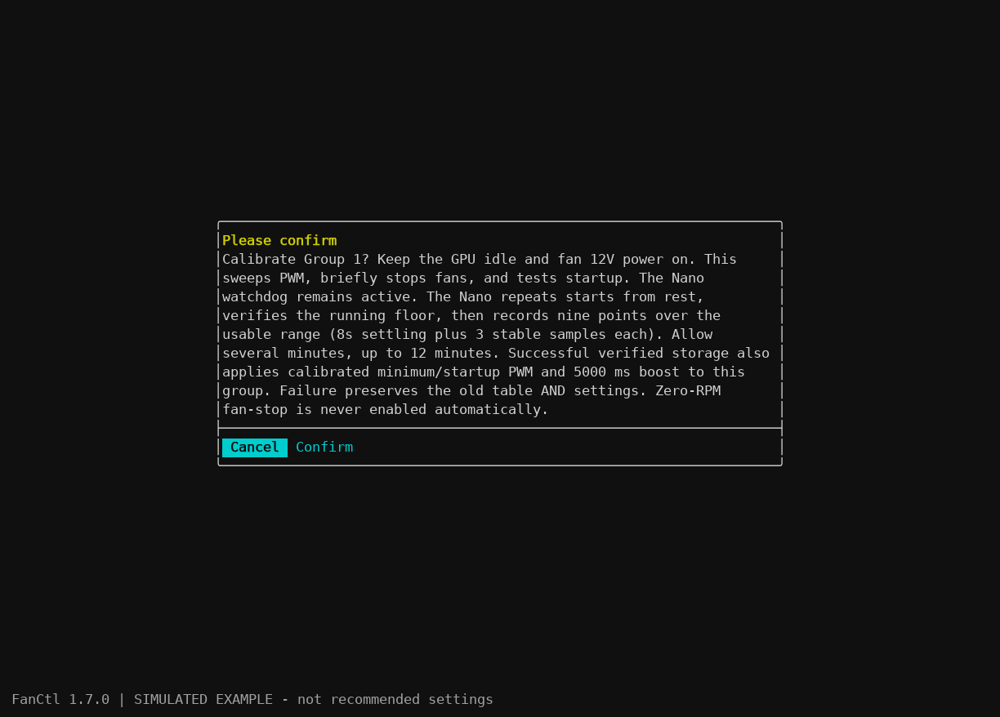

4. Leave the hardware supervised while it runs. Progress refreshes on this tab;
   temperature forwarding continues independently. A typical run takes several
   minutes; the Nano's overall limit is 12 minutes. Each of the nine sweep points
   gets eight seconds to settle, then three stable samples. Start/floor checks
   run separately and can revisit the same PWM.

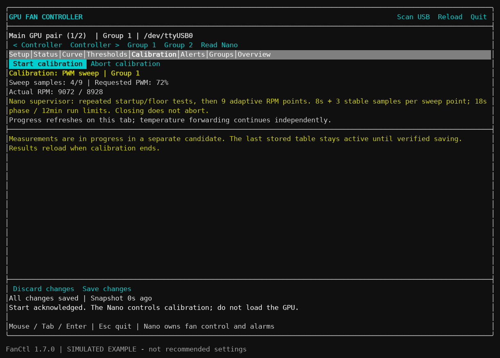

5. Wait for **Saved - EEPROM verified** and the reloaded measurement table.
   **Saving measurements** is not yet confirmation of persistent storage.

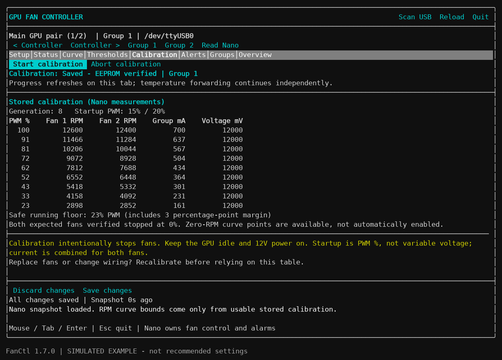

There is **no extra Save changes step to save calibration**. Success has already
saved the table, safe minimum PWM, startup PWM and a five-second startup boost.
The curve remains unchanged: review it next. The two startup percentages shown
above the table are individual fan measurements; the group's applied startup
PWM includes the required safety margin and may be higher.

If a run aborts, fails validation or cannot save, the previous good calibration
and its PWM settings are preserved. With no previous calibration, there is no
good table to fall back to. Investigate before running a GPU workload. Recalibrate
after replacing fans or changing wiring/topology, even if the fan count is unchanged.

**Abort calibration** explicitly stops a run. Closing the utility or changing
tabs does not abort it. The abort control targets the active calibration on that
controller, so check the reported group before confirming.

### If calibration is refused

Read the dialog and fix the stated condition. Low, high or unavailable group
voltage can offer **Override & start** in eligible cases; Cancel is the default.
An override accepts a real cooling/measurement risk for that attempt only. Do
not use it to work around an unpowered fan supply. Missing/stale or unsafe GPU
temperatures, missing INA hardware and other hard blockers cannot be overridden.
The Nano's ongoing safety checks still apply. More detail:
[calibration safety, measurement and storage rules](CALIBRATION.md).

## 4. Set the temperature/RPM curve

Open **Curve** after a successful calibration or Read Nano of an existing table.

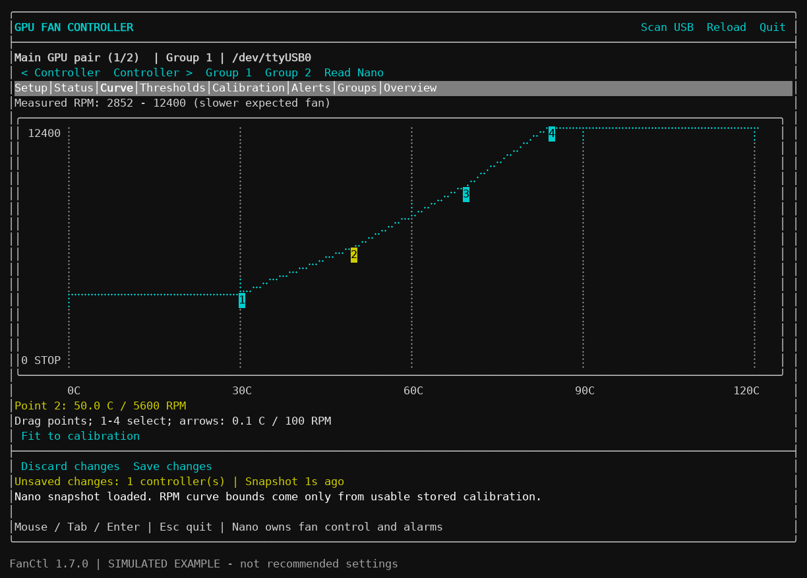

The horizontal axis is GPU temperature in degrees Celsius. The vertical axis is
requested **RPM**, bounded by the calibration of the slower expected fan, not
an assumed maximum speed. Actual fan speeds appear on Status, not on this graph.

1. If the existing curve is outside the newly measured range, click **Fit to
   calibration**. This adjusts the draft to usable limits; it does not save it.
2. Drag numbered points to set your curve. Alternatively click the graph,
   select a point with **1–4**, then use arrows: left/right change temperature
   by 0.1 C; up/down change RPM by 100.
3. Keep temperatures strictly increasing and RPM nondecreasing. The editor keeps
   the existing number of points (up to four); it does not add/remove points.
4. Review the selected point's numeric temperature/RPM below the graph. Cyan
   is the draft curve; gray is the last-read curve.
5. Click **Save changes**, confirm, and wait for the success/readback message.

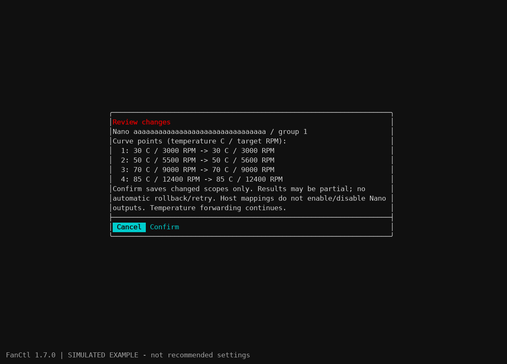

Choose values appropriate to your GPU, fan airflow and enclosure, then verify
cooling under supervised operation. The example curve is not thermal guidance.

**0 STOP** is offered only when calibration verified that every expected fan
stops at 0% PWM. Selecting it explicitly allows fan-stop in that temperature
region. It is not another name for the minimum running RPM; positive targets
cannot use the unverified gap below the measured running minimum. Calibration
does not enable fan-stop automatically, and safety overrides still apply.

## 5. Set alert thresholds and startup settings

Open **Thresholds**. It has three subpages. Click a value and type its replacement;
Tab moves between fields. Read the units beside each field before applying.

### Temperature / RPM — per group

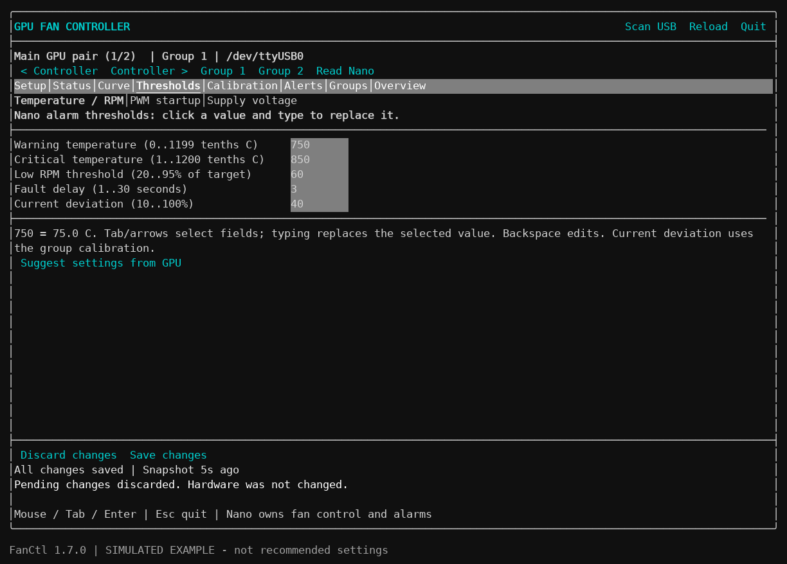

- **Warning / critical temperature:** entered in tenths of a degree, so `750`
  means 75.0 C. Warning must be below critical.
- **Low RPM threshold:** a percentage of requested target RPM, not a fixed RPM.
- **Fault delay:** seconds used by the applicable fan-fault checks, not a general
  permission to ignore all safety conditions.
- **Current deviation:** tolerance relative to calibration. Current is measured
  for the fan pair; individual tachometers identify which fan has stopped.

These are selected-group drafts. Save with **Save changes** and confirmation.

### Suggest initial settings from the GPU

Click **Suggest settings from GPU** on Thresholds for the selected controller and
mapped group. It reads NVIDIA core or experimental AMD edge limits without a USB
scan. Edit the margins in whole Celsius degrees (unlike the threshold fields,
which use tenths). Select **Include final curve point** only if you want to set
the last point to maximum calibrated RPM at the proposed temperature.

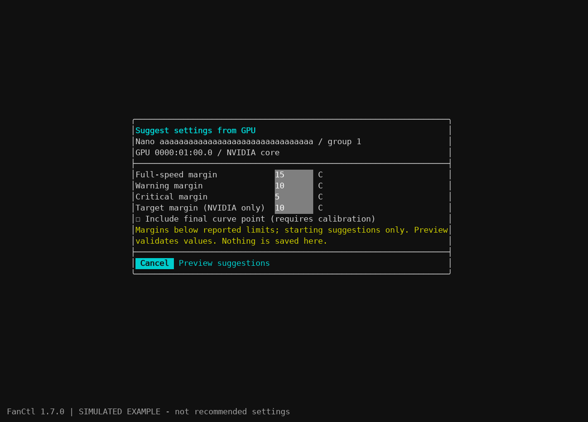

**Preview suggestions** shows the reported limits and proposed changes. Missing
limits, conflicting curve points and invalid margins are blocked, not guessed or
clamped. Without calibration, leave curve assistance unchecked; threshold-only
suggestions can still work. The default margins are starting suggestions, not
manufacturer-approved or guaranteed-safe settings.

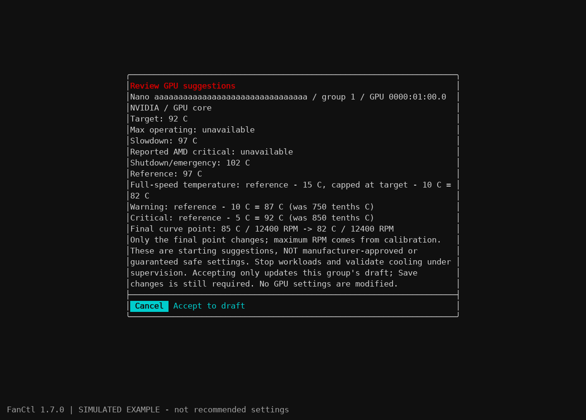

**Accept to draft** rechecks that the mapping, settings, calibration and GPU limits
have not changed during review, then stages only this group's proposed fields.
Use **Save changes** to persist them. Nothing is automatically applied on startup,
rescan or reconnect. Stop workloads and supervise validation of any new settings.
See [the complete suggestion rules](GPU_THERMAL_SUGGESTIONS.md).

### PWM startup — per group

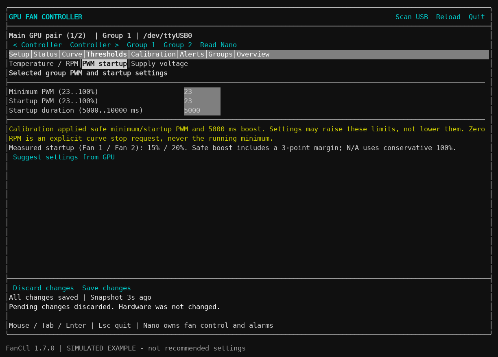

**Minimum PWM** is the running floor. **Startup PWM** and **Startup duration**
provide a boost when starting fans. Duration is in milliseconds: `5000` is five
seconds. These are unrelated to the manual Full/Off timeout.

Fresh calibration sets measured safe limits. You may raise them, but cannot
lower them below the measured safeguards or shorten a calibrated boost below
five seconds. Apply minimum-PWM changes separately from curve changes, then
read/review the updated usable RPM range. Save with **Save changes**.

### Supply voltage — whole controller

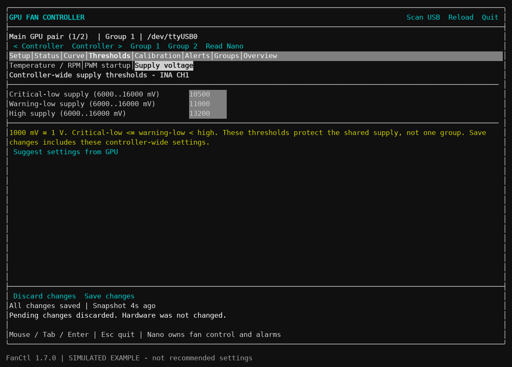

These thresholds monitor **INA CH1** and affect both groups on the selected
controller. Values are millivolts: `11000` means 11.0 V. Keep
**critical-low ≤ warning-low < high** within the displayed limits.

Use **Save changes**. The review includes this controller-wide scope alongside
any pending group or daemon edits. The current status packet does not include the CH1 voltage itself;
the group voltages shown elsewhere are CH2/CH3 measurements.

## 6. Verify cooling with live monitoring

### Status — selected controller and group

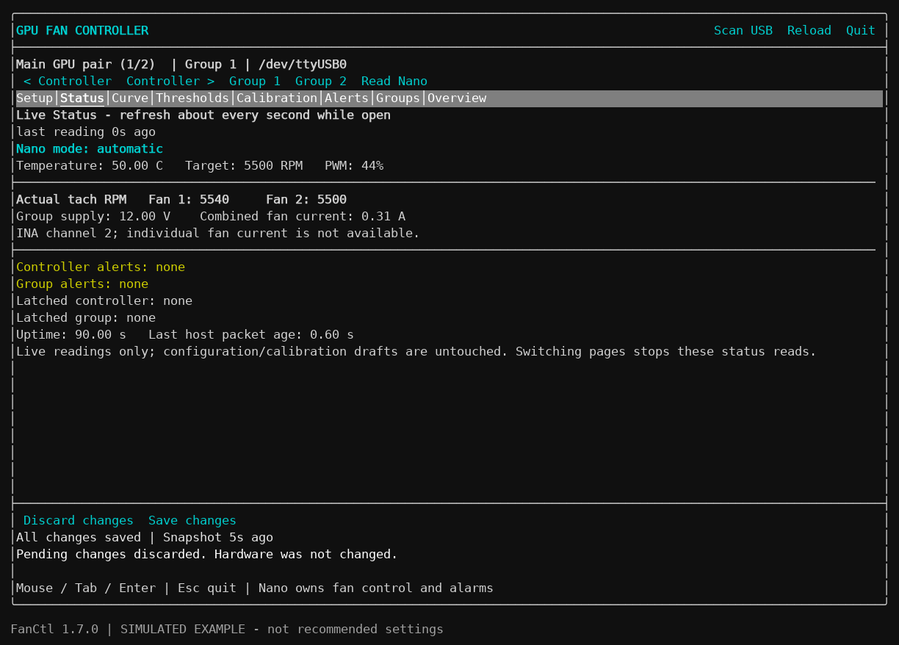

Status refreshes about once a second while open. Read Nano is not needed to start
live monitoring with matching current host software.

- **Target RPM** is what the Nano requests; **Actual tach RPM** is each fan's
  measured speed. They need not match exactly, especially during a transition.
- **PWM** is the output duty, not a percentage of maximum measured RPM.
- **Group supply / Combined fan current** describe the whole fan pair on CH2
  or CH3, not separate fan-current readings.
- **Last host packet age** shows how recently the Nano received a temperature
  snapshot. Unchanged temperatures are resent after five seconds.
- **Mode** explains whether the curve, a manual command, calibration or a safety
  override currently governs output.

Readings that fail or become five seconds old are shown as unavailable/stale,
not as trustworthy zero values. Check the live sample age; the footer's editor
Snapshot age can be older without the live feed being stale.

Before starting workloads, verify the correct GPU temperatures reach the correct
groups, all expected fans physically turn, both tach readings make sense, and
there are no unexplained active faults. Monitor temperatures as load is introduced.
A healthy screen alone does not prove sufficient airflow.

### Overview — all saved controllers

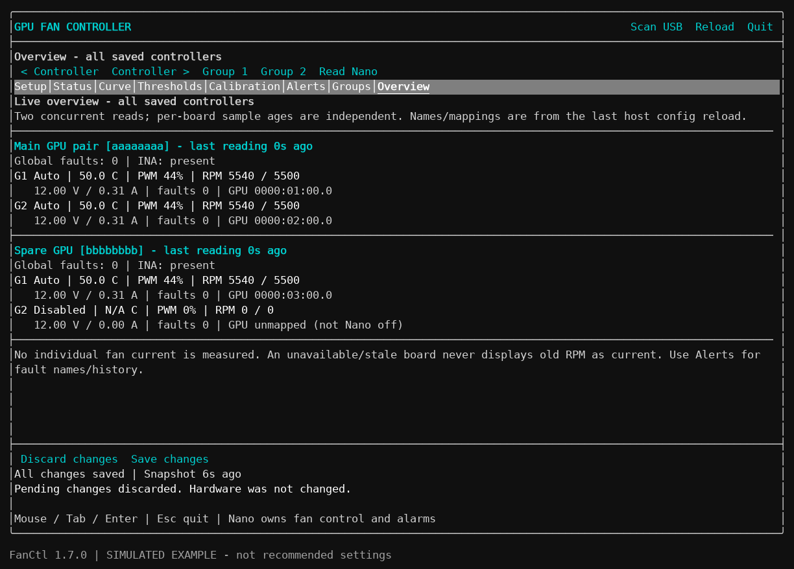

Overview displays every saved controller, regardless of the selected-controller
buttons. Each board has its own age/error indication; an offline board does not
freeze the others. Larger installations refresh in turns, so every board may not
update each second. Use Reload after external host-mapping/name changes. Fault
numbers here are masks; use Alerts for readable explanations.

Leaving these live pages stops their detailed status polling. Closing FanCtl
returns communication to the daemon's normal temperatures, replies and alerts.

## Respond to alerts

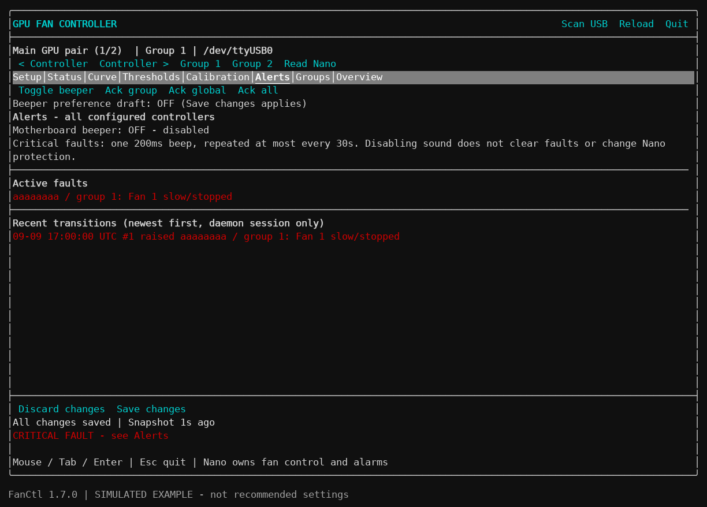

Cooling faults are detected by the Nano. The daemon collects active conditions
and recent raised/cleared events across controllers, and also reports connection
failures of its own. A critical banner appears on every tab. Recent event history
is for the current daemon session; use the journal for retained logs after a restart.

1. Identify the controller, group and fault. For a cooling failure, stop the GPU
   workload and check the hardware before changing settings.
2. Use live Status and physical inspection to confirm what is wrong. A missing
   reading is not proof that a fan has stopped, nor proof that it is safe.
3. Correct the cause and verify the active condition has cleared.
4. If needed, acknowledge the remembered **latched** flags using **Ack group**,
   **Ack global** or **Ack all**. Check the selected controller/group first.

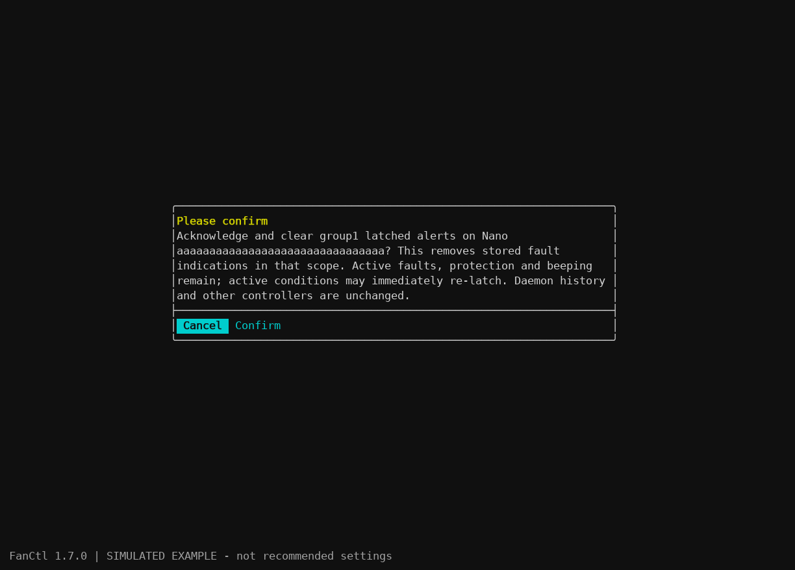

**Active** means a condition is present now. **Latched** records that it happened.
Acknowledgement does not repair the fault, disable protection or erase event
history. An active condition can relatch immediately. Ack global refers to that
Nano's controller-wide flags; Ack all covers that Nano's global and both group
latches, **not every Nano in the installation**.

**Toggle beeper** changes the draft preference for the daemon’s optional Ubuntu
motherboard/PC speaker notification. **Save changes** reviews and applies it;
simply toggling the draft does not enable sound. This setting is host-wide. It is not
a terminal bell or a Nano buzzer; hardware/OS support is required and the UI can
report it unavailable. Do not rely on sound as the only indication of failure.
See [alert behavior and speaker setup](ALERTS.md).

## Everyday tasks

- **Check the system:** open Overview, investigate faults in Alerts, and use
  Status for individual fan measurements. No configuration save is required.
- **Change a curve:** select the correct controller/group, Read Nano, edit Curve,
  Save changes, confirm and verify Status.
- **Replace a fan:** stop workloads and safely power down for wiring. Restore
  power, update expected fans if necessary, apply, recalibrate, review the curve
  and verify cooling. Do not reuse the old current/RPM baseline blindly.
- **Use full speed temporarily:** Groups → choose timeout → Full speed → Confirm.
  Auto cancels the override early. Observe actual mode/PWM in Status.
- **Finish using FanCtl:** apply or discard drafts, then Quit. The daemon keeps
  working. An active calibration or timed override also continues.

## Troubleshooting

| Symptom | Check / next action |
| --- | --- |
| Cannot connect to daemon | Check the service and logs using the commands below. The installed API uses local port 8787; the isolated developer setup uses 8788. |
| Nano not found | Check USB and firmware, then Scan USB with cooling supervised. In WSL, check USB/IP attachment. Close competing serial monitors/daemons; do not let multiple processes own the same Nano. |
| GPU absent from choices | Scan USB also refreshes GPU discovery; check scan warnings and driver/sensor availability. AMD needs native Linux amdgpu, not merely a GPU visible in WSL. |
| GPU name unavailable | Startup/Reload uses cached GPU names from the daemon; Read Nano can supply a matching saved label with firmware 1.7.0. If neither has a name, Scan USB refreshes discovery, then Save changes stores the label. A stale label for a different mapping is not reused. |
| Fans run at 100% despite Off/Disabled | Check Status/Alerts and packet age. Missing temperature snapshots for 10 seconds forces both groups to full speed, even when disabled. An enabled group also needs valid safe GPU temperature data. |
| Fans briefly jump to 100% at steady GPU temperature | Compare Nano alerts with `GPU temperature diagnostic` journal entries. The daemon tries a failed query three times total, with 250 ms between attempts, retaining still-fresh last-good readings during retries. Exhaustion or three-second sample expiry can trigger Temperature invalid without a ten-second host timeout. [Diagnostic records](TEMPERATURE_FORWARDING.md#diagnosing-intermittent-full-speed-events) include exhausted query errors, timings, mapped groups and recovery; successful retry episodes are silent. |
| Calibration required / curve unavailable | Read Nano, calibrate the selected group, and wait for verified storage. Changing expected fans invalidates its previous calibration. |
| Save changes reports no changes after calibration | Calibration already saved itself. With no draft edits there is nothing to apply. To change the curve, edit it or use Fit to calibration first, then Save changes and confirm. |
| Calibration blocked, aborted or timed out | Keep GPUs idle; check fan power, tachs, INA readings, temperature forwarding and the exact message. Previous good data is preserved; do not assume the new run was saved. |
| Save reports a generation conflict | Configuration changed since it was read. Record intended edits, discard/re-read as prompted, review and apply again against the current state. |
| Write/readback not confirmed | The Nano may already have applied the change. Read the per-destination results. Another Save changes performs fresh reads and offers an explicitly confirmed retry; unrelated conflicts must be resolved first. |
| Old RPM shown / unavailable / stale feed | Check the relevant sample age, daemon connectivity and errors. Do not treat missing telemetry as zero or assume old readings are current. |
| Mouse or graph dragging fails | Use Tab/Shift+Tab/Enter and graph number/arrow keys. Check terminal mouse reporting and enlarge the terminal; scroll long pages. |
| Beeper enabled but no sound | Check its reported availability and the PC speaker setup; many systems and WSL environments have no usable motherboard speaker. |

Read-only diagnostic commands:

```sh
fanctl status --json
systemctl status gpu-fan-controller.service
journalctl -u gpu-fan-controller.service -n 50 --no-pager
```

Do not casually stop/restart the daemon during GPU workloads. The Nano's
10-second timeout is a firmware safety behavior, **not a hardware reset watchdog**;
it cannot recover a frozen firmware loop or protect cooling while firmware is
being flashed. For updates or recovery, stop workloads and follow the
[installation/update guide](RELEASES.md).

For deeper details, see the [UI technical guide](CONTROLLER_UI.md),
[configuration reference](CONFIGURATION.md) and
[temperature-forwarding behavior](TEMPERATURE_FORWARDING.md).
